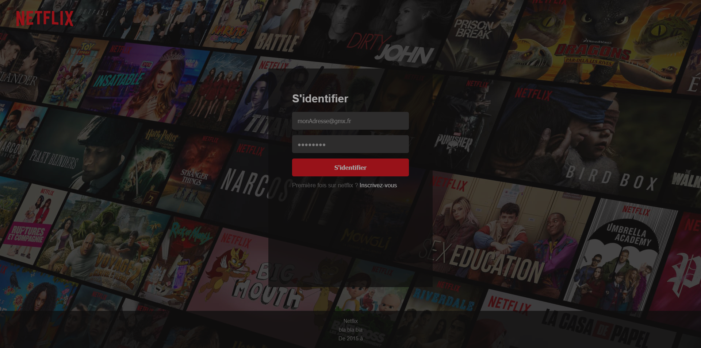
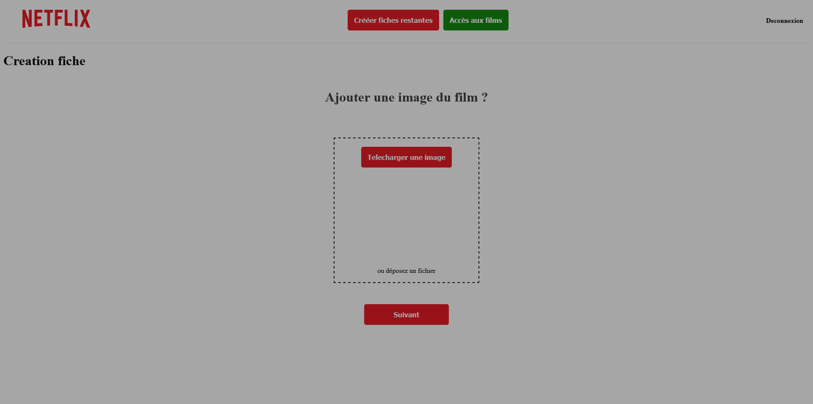
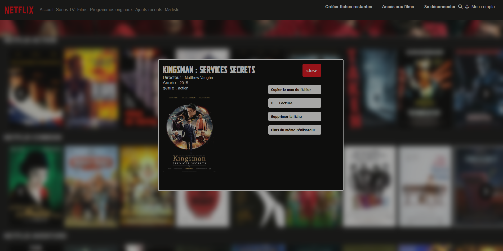

# Trieuse de Film 

## Application qui créer des fiches pour des films

 
  
   

## Technos :

## Description:
Server Node.js qui crud fiches de film et utilisateurs 
Les films sont à déposer dans le dossier "films" 
Après connexion, on a accès aux fiches et à la création de fiches supplémentaires 

## Ajout:
Ajouter 2 dossiers : images et films dans le dossier "back" 
Ajouter les films manuellement dans le dossier films 
Demarer en local sur le fichier index.html pour ne pas à télécharger les films
 
## Variables d'environnement:
A la racine du back :  
> USER="identifiants mongodb" 
> PASSWORD="passwordMongodb" 
> SECRET_KEY="chaine de charactères" 

### Installer node.js

### Installer les dépendances:

`npm install`

### Lancer le serveur:
Se placer sur le back
`node server`

### Lancer l'application:
A la racine du projet, compiler le js en un fichier bundle.js
`npm run start`
